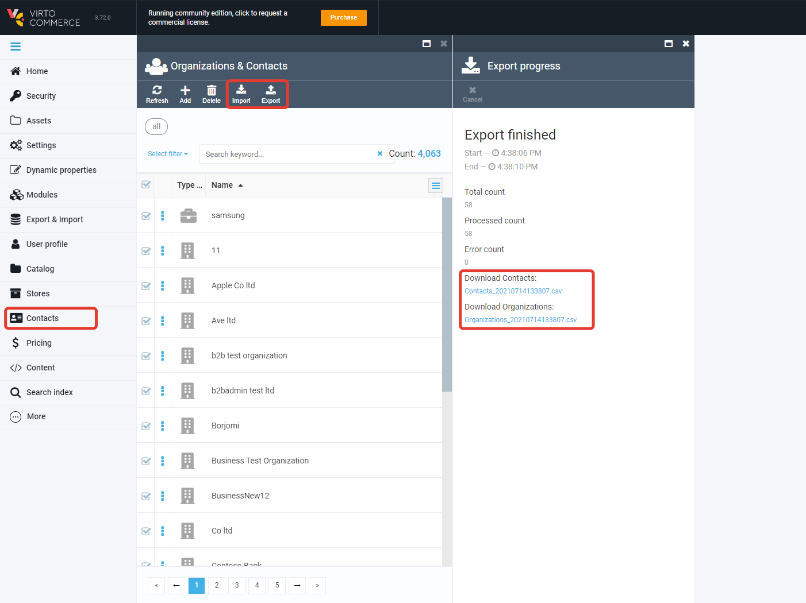

# customer Export & Import module

If you want to transfer a customers accounts such as contacts, organizations and Virto Commerce users accounts between Virto Commerce and another system, use a CSV (semicolon-separated value) spreadsheets to perform this kind of bulk task.

The business goal for the module is to provide customers export and import functionality to non-technical business users (like "category manager"), who works with customers on a daily basis and does not use the SQL databases as primary tools.

### Note
If you want to automated transferring information from 3rd party system, like ERP, then see API, Integration Middleware approach and Azure Logic Apps connectors.

## Business scenarios
* I need to export contacts to edit and to update.
* I need to export organizations to edit and to update.
* I need to migrate contacts from another system.
* I need to migrate organizations from another system.
* I need to migrate acoounts from another system.

## Documentation
* [Module Documentation](https://virtocommerce.com/docs/latest/modules/customer-export-import/)
* [View on GitHub](docs/index.md)

## Development
    Abstractions and implementation including public API can be changed in next releases (breaking changes may be introduced).

## References

* Deploy: https://virtocommerce.com/docs/latest/developer-guide/deploy-module-from-source-code/
* Installation: https://www.virtocommerce.com/docs/latest/user-guide/modules/
* Home: https://virtocommerce.com
* Community: https://www.virtocommerce.org
* [Download Latest Release](https://github.com/VirtoCommerce/vc-module-customer-export-import/releases/latest)

## License

Copyright (c) Virto Solutions LTD.  All rights reserved.

Licensed under the Virto Commerce Open Software License (the "License"); you
may not use this file except in compliance with the License. You may
obtain a copy of the License at

http://virtocommerce.com/opensourcelicense

Unless required by applicable law or agreed to in writing, software
distributed under the License is distributed on an "AS IS" BASIS,
WITHOUT WARRANTIES OR CONDITIONS OF ANY KIND, either express or
implied.
