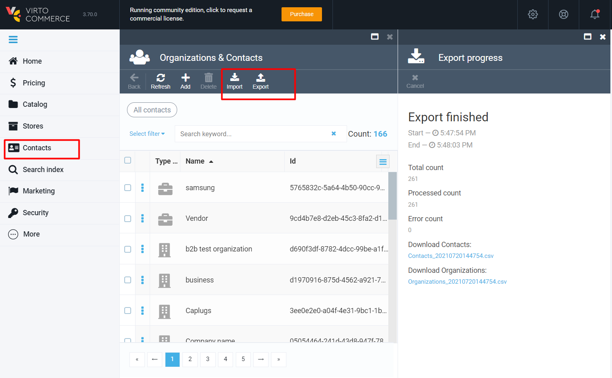

# Overview

If you want to transfer a large amount of customer information between Virto Commerce and another system, then you can use a specially-formatted spreadsheet to import or export that data. Virto Commerce uses CSV (semicolon-separated value) files to perform this kind of bulk task.

The business goal for the module is to provide to non-technical not high skilled business users (like customer manager) who works with customers on a daily basis and do not understand the database structure to work comfortably with customers export and import functionality using it for customers management.

> Note If you want to automated transferring information from 3rd party system, like ERP, then see API, Integration Middleware approach and Azure Logic Apps connectors.

## Business scenarios

- I need to create a new organization with customers.
- I need to make bulk changes for multiple customers in the organization of few hundreds of records.
- I need to migrate contacts from another system.
- I need to migrate organizations from another system.

## Using CSV

Get a sample CSV file.
You can export and view a sample contacts or organizations CSV file and use it as a template.

## Contact CSV file format for import

The first line of CSV file should be Header:

Contact First Name \*required 
Contact Last Name \*required 
Contact Full Name \*required 
Contact Id 
Contact Outer Id 
Organization Id 
Organization Outer Id 
Organization Name 
Email 
Account Login \*required for account 
Store Id \*required for account 
Store Name 
Account Email \*required for account 
Account Type 
Account Status 
Email Verified 
Contact Status 
Associated Organization Id 
Birthday 
TimeZone 
Phones 
Salutation 
Default language 
Taxpayer ID 
Preferred communication 
Preferred delivery 
Address Type \*required for address 
Address First Name \*required for address 
Address Last Name \*required for address 
Address Country \*required for address 
Address Region \*required for address 
Address City \*required for address 
Address Line1 \*required for address 
Address Line2 \*required for address 
Address Zip Code \*required for address 
Address Email \*required for address 
Address Phone \*required for address 
All Dynamic Properties 

> Each column must be separated by a semicolon. Only Contact First Name, Contact Last Name, Contact Full Name values are required for Contact creation.

> All Address values are required for creation/updating address. If you don't need to create/update address leave it empty.

> You can create new account in relation to contact. Account name, Account email, Store id values are required for Account creating. 
> Account name and Account email should be unique for each account. Please notice, you can only create account, but not update.

> In case of errors full contact line will be skipped. You can download error report on statistics page and check error detail for skipped line.

Example: [Contacts\_sample.csv](media/samples/Contacts_sample.csv)

**Organizations CSV file format for import**

The first line should be Header:

Organization Name \*required 
Organization Id 
Organization Outer Id 
Address Type \*required for address 
Address First Name \*required for address 
Address Last Name \*required for address 
Address Country \*required for address 
Address Region \*required for address 
Address City \*required for address 
Address Address Line1 \*required for address 
Address Address Line2 \*required for address 
Address Zip Code \*required for address 
Address Email \*required for address 
Address Phone \*required for address 
Phones 
Business category 
Description 
All Dynamic Properties 

> Each column must be separated by a semicolon. Only Organization name value is required for creation organization.

> All Address values are required for creation/updating address. If you don't need to create/update address leave it empty.

> In case of errors organization line will be skipped. You can download error report on statistics page and check error detail for skipped line.

Example: [Organizations\_sample.csv](media/samples/Organizations_sample.csv)

## Export Contacts and Organizations

### Export selected organizations

1. The user opens root of Contact Module 
2. Select few organizations > click export
3. The system opens the Simple export dialog screen with the text "NUM contacts NUM organizations will be exported to csv file."
4. User confirms export
5. The system opens the processing blade with links when the export is finished
6. Links to download organizations.csv file and contacts.csv file are displayed.

> If Contact has more than one related accounts, organizations, addresses than only one account, organization, address will be exported according to this contact.

### Export all from Customer module

1. The user opens root of Contact Module 
2. Click export
3. The system opens the Simple export dialog screen with the text "NUM contacts NUM organizations will be exported to csv file."
4. User confirms export
5. The system opens the processing blade with links when the export is finished
6. Links to download organizations.csv file and contacts.csv file are displayed

## Contacts import

### Create new contacts and new organizations

1. The user opens root of Contact Module > click import
2. Upload file >
3. The system shows Uploaded CSV file
4. The user opens uploaded file to preview > Click Import
5. The system shows a popup with the text: "NUM contacts will be added according to linked organizations"
6. The system creates new organizations if their Id and OuterID not exist in the system

> You should select the type of CSV file (contact or organization) before browsing and uploading the file to the system

### Create contacts into organization

1. The user opens Contact Module > Open Name organization > click Import
2. Upload file >
3. The system shows Uploaded CSV file
4. The user opens uploaded file to preview > Click Import
5. The system shows a popup with the text: "NUM contacts will be added into Name organization"
6. The system creates new contacts into the Name organization

### Create accounts throught contact.csv import

1. The user opens root of Contact Module > click import
2. Upload file >
3. The system shows Uploaded CSV file
4. The user opens uploaded file to preview > Click Import
5. The system shows a popup with text: "NUM contacts will be imported"
6. The system creates accounts in relation to contact in the system

### Update existing contacts

1. The user opens root of Customer management module > click import
2. Upload file >
3. The system shows Uploaded CSV file
4. The user opens uploaded file to preview > Click Import
5. The system shows a popup with text: "NUM contacts will be imported"
6. The system finds contacts and organization in the system by Id or Outer Id and updates them

## Import Organizations

### Create new organizations

1. The user opens root of Customer management module > click import
2. Upload file >
3. The system shows Uploaded CSV file
4. The user opens uploaded file to preview > Click Import
5. The system shows a popup with the text: "NN organizations will be imported"
6. The system creates a new organization and places it in the root.

> It is important to know that organizations can be imported into root only

### Update existing organizations

1. The user opens root of Customer management module > click import
2. Upload file >
3. The system shows Uploaded CSV file
4. The user opens to preview uploaded file > Click Import
5. The system shows a popup with the text: "NN organizations will be imported"
6. The system finds Organizations in the system by Id or Outer Id and updates them. Organization places into the Root

## Advanced settings

Limit for number of lines to export = 10.000 by default. 
Ask system administrator to change it throught an environment variable for `CustomerExportImport__Export__LimitOfLines`

Limit for number of lines to import = 10.000 by default. 
Ask system administrator to change it throught an environment variable for `CustomerExportImport__Import__LimitOfLines`

Limit for size of csv file = 1mb by default. 
Ask system administrator to change it throught an environment variable for `CustomerExportImport__Import__FileMaxSize`

## Requirements for data

For both contacts & organizations: 

Address Country, Address Country Code should follow ISO 3166-1 alpha-3 standard 
Dynamic property: type sh 
Address Country, Address Country Code should follow ISO 3166-1 alpha-3 standard 
Dynamic property: type should correlate to specified in admin 

Maximum length for values in columns: 

Address First Name - 128 
Address Last Name - 128 
Address Email - 64 
Address Phone - 256 
Address Line 1 - 128 
Address Line 2 - 128 
Address City - 128 
Address Region - 128 
Address Country Code - 64 
Address County - 128 
Address Zip Code - 32 
Dynamic property with type ShortText - 512 per value   
Phones - 64 per value 
Contact Outer Id - 128 
Contact First Name - 128 
Contact Last Name - 128 
Contact Full Name - 254 
Organization Outer Id - 128 
Organization Name - 128 
Contact Status - 64 
TimeZone - 32 
Salutation - 256 
Default Language - 32 
Tax Payer Id - 64 
Preferred Delivery - 64 
Preferred Communication - 64   
Organization Outer Id - 128 
Organization Name - 128 
Business Category - 64 
